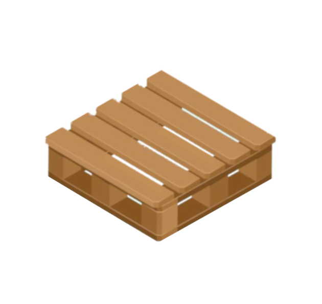

# pallet
Library for Cross-Platform Development



Provides support for various expressive idioms typical of scripting languages, with a goal of supporting portable code runnable across platforms with minimal customization.

* No Dependencies

* Supported Scala Versions
  * `scala 3.x`
  * `scala 2.13`

* Tested Target environments
  * `Linux`
  * `Windows`
  * `Cygwin64`
  * `Msys64`
  * `Mingw64`
  * `Git-bash`
  * `WSL Linux`

* Infrequently Tested
  * `OSX`

### Usage

Add the following dependency to `build.sbt`
```sbt
  "org.vastblue" % "pallet" % "0.8.6"
```

### Example `scala-cli` script:
```scala
#!/usr/bin/env -S scala-cli.bat shebang

//> using scala "2.13.12"
//> using lib "org.vastblue::pallet::0.8.6"

import vastblue.pathextend._

def main(args: Array[String]): Unit = {
  // show system memory info
  for (line <- "/proc/meminfo".path.lines) {
    printf("%s\n", line)
  }
  // list child directories of "."
  val cwd: Path = ".".path
  for ( p: Path <- cwd.paths.filter { _.isDirectory }){
    printf("%s\n", p.norm)
  }
}
main(args)
```

### Example `scala3` script
In `scala 3.x`, the classpath may be defined with an `@atFile`

Example `@atFile` (written to ~/.scala3cp in this example):
```
-cp /Users/username/.ivy2/local/org.vastblue/pallet_2.13/0.8.6/jars/pallet_2.13.jar
```

```scala
#!/usr/bin/env -S scala -cp @/home/username/.scala3cp
import vastblue.pathextend.*

def main(args: Array[String]): Unit = {
  // show system memory info
  for (line <- "/proc/meminfo".path.lines) {
    printf("%s\n", line)
  }
  // list child directories of "."
  val cwd: Path = ".".path
  for ( p: Path <- cwd.paths.filter { _.isDirectory }){
    printf("%s\n", p.norm)
  }
}
```

### Using `SCALA_OPTS` environment variable

* create an `atFile` with your classpath (e.g., `~/.scala3cp`)
* define `SCALA_OPTS`
  * `SCALA_OPTS="@/Users/username/.scala3cp -save"`

With this setting and if `scala 3` is in your `PATH`, you can do this:
```bash
$ scala vastblue.Platform

username@d5 MINGW64 ~/workspace/pallet
# scala vastblue.Platform
runtime scala version: [3.3.1]
SYSTEMDRIVE: C:
C:/Users/username/workspace/pallet/.bloop
C:/Users/username/workspace/pallet/.bsp
C:/Users/username/workspace/pallet/.git
C:/Users/username/workspace/pallet/.github
C:/Users/username/workspace/pallet/.idea
C:/Users/username/workspace/pallet/.metals
C:/Users/username/workspace/pallet/.vscode
C:/Users/username/workspace/pallet/bin
C:/Users/username/workspace/pallet/docs
C:/Users/username/workspace/pallet/images
C:/Users/username/workspace/pallet/jsrc
C:/Users/username/workspace/pallet/myproject
C:/Users/username/workspace/pallet/project
C:/Users/username/workspace/pallet/src
C:/Users/username/workspace/pallet/target
C:/Users/username/workspace/pallet/tmp
MemTotal:      133871912 kB
MemFree:        93266696 kB
HighTotal:             0 kB
HighFree:              0 kB
LowTotal:      133871912 kB
LowFree:        93266696 kB
SwapTotal:       8388608 kB
SwapFree:        7998836 kB
basename    : C:/msys64/usr/bin/basename.exe
bash        : C:/msys64/usr/bin/bash.exe
cat         : C:/msys64/usr/bin/cat.exe
chgrp       : C:/msys64/usr/bin/chgrp.exe
chmod       : C:/msys64/usr/bin/chmod.exe
chown       : C:/msys64/usr/bin/chown.exe
cksum       : C:/msys64/usr/bin/cksum.exe
cp          : C:/msys64/usr/bin/cp.exe
curl        : C:/msys64/usr/bin/curl.exe
date        : C:/msys64/usr/bin/date.exe
diff        : C:/msys64/usr/bin/diff.exe
env         : C:/msys64/usr/bin/env.exe
file        : C:/msys64/usr/bin/file.exe
find        : C:/msys64/usr/bin/find.exe
git         : C:/msys64/usr/bin/git.exe
gzip        : C:/msys64/usr/bin/gzip.exe
head        : C:/msys64/usr/bin/head.exe
hostname    : C:/msys64/usr/bin/hostname.exe
ln          : C:/msys64/usr/bin/ln.exe
ls          : C:/msys64/usr/bin/ls.exe
md5sum      : C:/msys64/usr/bin/md5sum.exe
mkdir       : C:/msys64/usr/bin/mkdir.exe
nohup       : C:/msys64/usr/bin/nohup.exe
uname       : C:/msys64/usr/bin/uname.exe
cygdrive     [/]
bashPath     [C:\msys64\usr\bin\bash.exe]
cygpathExe   [C:/msys64/usr/bin/cygpath.exe]
realroot     [C:/msys64/]
realrootbare [/msys64/]
realrootfull [C:/msys64/]
osName       [Windows 11]
unamefull    [MINGW64_NT-10.0-22621 d5 3.4.9.x86_64 2023-09-15 12:15 UTC x86_64 Msys]
unameshort   [mingw64]
isCygwin     [false]
isMsys64     [false]
isMingw64    [true]
isGitSdk64   [false]
isWinshell   [true]
bash in path [C:\msys64\usr\bin\bash.exe]
cygdrive2root[true]
wsl          [false]
javaHome     [C:\opt\jdk]
etcdir       [C:\msys64\etc]

all bash in path:
 found at [C:\msys64\usr\bin\bash.exe]         : --version: [GNU bash, version 5.2.15]
 found at [C:\windows\system32\bash.exe]       : --version: [GNU bash, version 5.1.16]

found 7 windows shell root dirs:
 C:\cygwin64
 C:\msys64
 C:\rtools42
 C:\opt\gitbash
 C:\opt\GitLab-Runner
 C:\Program Files\Git
 C:\Program Files\GitHub CLI
```

Running `vastblue.Platform` in `WSL2 Ubuntu` produces this:
```bash
runtime scala version: [3.3.1]
SYSTEMDRIVE: 
/home/username/workspace/pallet/.bsp
/home/username/workspace/pallet/src
/home/username/workspace/pallet/.bloop
/home/username/workspace/pallet/.idea
/home/username/workspace/pallet/.git
/home/username/workspace/pallet/.github
/home/username/workspace/pallet/project
/home/username/workspace/pallet/target
/home/username/workspace/pallet/images
/home/username/workspace/pallet/jsrc
MemTotal:       49337504 kB
MemFree:        42174956 kB
MemAvailable:   45546548 kB
Buffers:          456096 kB
Cached:          3292128 kB
SwapCached:            0 kB
Active:          2276732 kB
Inactive:        4428420 kB
Active(anon):       1928 kB
Inactive(anon):  2957904 kB
Active(file):    2274804 kB
Inactive(file):  1470516 kB
Unevictable:           0 kB
Mlocked:               0 kB
SwapTotal:       8388608 kB
SwapFree:        8388608 kB
Dirty:             18100 kB
Writeback:             0 kB
AnonPages:       2863220 kB
Mapped:           816592 kB
Shmem:              2904 kB
KReclaimable:     201932 kB
Slab:             242536 kB
SReclaimable:     201932 kB
SUnreclaim:        40604 kB
KernelStack:        5436 kB
PageTables:        13188 kB
NFS_Unstable:          0 kB
Bounce:                0 kB
WritebackTmp:          0 kB
CommitLimit:    33057360 kB
Committed_AS:    5331948 kB
VmallocTotal:   34359738367 kB
VmallocUsed:       27592 kB
VmallocChunk:          0 kB
Percpu:              544 kB
AnonHugePages:   1187840 kB
ShmemHugePages:        0 kB
ShmemPmdMapped:        0 kB
FileHugePages:         0 kB
FilePmdMapped:         0 kB
HugePages_Total:       0
HugePages_Free:        0
HugePages_Rsvd:        0
HugePages_Surp:        0
Hugepagesize:       2048 kB
Hugetlb:               0 kB
DirectMap4k:       29696 kB
DirectMap2M:     7309312 kB
DirectMap1G:    52428800 kB
basename    : /usr/bin/basename
bash        : /usr/bin/bash
cat         : /usr/bin/cat
chgrp       : /usr/bin/chgrp
chmod       : /usr/bin/chmod
chown       : /usr/bin/chown
cksum       : /usr/bin/cksum
cp          : /usr/bin/cp
curl        : /home/philwalk/anaconda3/bin/curl
date        : /usr/bin/date
diff        : /usr/bin/diff
env         : /usr/bin/env
file        : /usr/bin/file
find        : /usr/bin/find
git         : /usr/bin/git
gzip        : /usr/bin/gzip
head        : /usr/bin/head
hostname    : /usr/bin/hostname
ln          : /usr/bin/ln
ls          : /usr/bin/ls
md5sum      : /usr/bin/md5sum
mkdir       : /usr/bin/mkdir
nohup       : /usr/bin/nohup
uname       : /usr/bin/uname
cygdrive     []
bashPath     [/usr/bin/bash]
cygpathExe   []
realroot     [/]
realrootbare [/]
realrootfull [/]
osName       [Linux]
unamefull    [Linux d5 5.15.90.1-microsoft-standard-WSL2 #1 SMP Fri Jan 27 02:56:13 UTC 2023 x86_64 x86_64 x86_64 GNU/Linux]
unameshort   [linux]
isCygwin     [false]
isMsys64     [false]
isMingw64    [false]
isGitSdk64   [false]
isWinshell   [false]
bash in path [/usr/bin/bash]
cygdrive2root[true]
wsl          [true]
javaHome     [/usr/lib/jvm/java-17-openjdk-amd64]
etcdir       [/etc]

all bash in path:
 found at [/usr/bin/bash]                      : --version: [GNU bash, version 5.1.16]
 found at [/bin/bash]                          : --version: [GNU bash, version 5.1.16]
 found at [/opt/jsnode/bash]                   : --version: [GNU bash, version 5.1.16]
```
